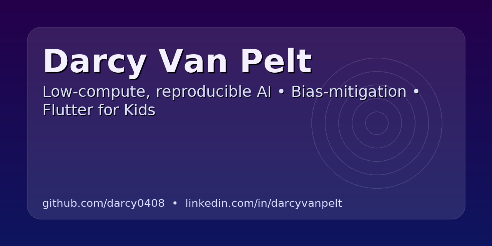

  

<h1 align="center">Hi, I’m Darcy 👋</h1>

CSU-Global B.S. CS (3.97 GPA) • Undergraduate research fellow • Low-compute, reproducible AI • Flutter & TypeScript apps I build and operate end to end

---

### What I’m about
- **Ship and operate, not just prototype:** production deploys, automated rollback, tested database recovery.
- **Reproducibility:** seeds, exact params, and restart-safe logs baked into every research project.
- **Accessible AI:** CPU-first pipelines that run on modest hardware.

### Skills & Stack
**Languages:** Python, TypeScript/JavaScript, Dart, Java, SQL
**Frameworks:** Flutter, React Native (Expo), Flask, FastAPI
**Infra & Dev:** Docker, PostgreSQL, GitHub Actions (CI/CD), Cloudflare Workers, Railway, REST APIs
**Research:** Agent-based modeling, OSMnx, model validation, spatial data

---

## Selected Projects

### 🚦 Portland Traffic ABM — *NSF REU research*
An agent-based model of interacting vehicles on Portland's street network. Vehicles follow one another, queue at signals, and back up in congestion; from those interactions the model produces street-segment surfaces of traffic NO2 and noise.
- The agent simulation **generates the predictors**, which are then fed into the same random-forest method a published land-use baseline used — so the comparison isolates what source-based interaction modeling adds over static estimation
- Closure experiments quantify that **61–76% of a closed arterial's emissions redistribute onto specific parallel routes**, naming which blocks inherit the burden
- HBEFA emission factors, CNOSSOS noise modeling benchmarked against the FHWA Traffic Noise Model
- Sole-author abstract accepted to the **ACM SIGSPATIAL 2026** Student Research Competition (undergraduate track)
- Repo: **[`portland-traffic-abm`](https://github.com/darcy0408/portland-traffic-abm)**

### 📖 Story Weaver — *Once Upon YOUR Child*
A production cross-platform app generating personalized, age-appropriate stories that help kids build feelings vocabulary and social-emotional skills. Built and operated solo.
- Flutter front end · Python/Flask API · PostgreSQL · Docker on Railway
- **10 CI/CD pipelines** — canary deployment, automated rollback, scheduled Postgres backups, and restore drills that verify backups actually recover
- 2,800+ commits and 220 test files over nine months of continuous delivery
- Live: **[onceuponyourchild.app](https://onceuponyourchild.app)** · Repo: **[`once-upon-your-child`](https://github.com/darcy0408/once-upon-your-child)**

### 📊 Misinformation Dynamics Model
A Python model of how a false rumor spreads through a population in Portland — exploring when misinformation settles, oscillates, or can be reversed by debunking.
- Built for the **PSU REU, “Computational Modeling Serving Portland”**
- Repo: **[`misinformation-dynamics-model`](https://github.com/darcy0408/misinformation-dynamics-model)**

### 🔥 Wildfire Evacuation ABM
An agent-based model asking whether a town fleeing a wildfire is safer leaving all at once or in staggered waves. Traffic jams and smoke exposure emerge from agent interaction rather than being scripted.
- Finds a density tipping point where the optimal strategy flips — and shows it disappears when the fire spreads fast
- Repo: **[`wildfire-evacuation-abm`](https://github.com/darcy0408/wildfire-evacuation-abm)**

### 🗣️ SoundingBoard
An iOS app for practicing difficult conversations with an AI persona that pushes back realistically, then scores clarity, composure, and assertiveness.
- Cloudflare Worker proxies all model and TTS calls, so **no API credentials ship in the client**; speech-to-text runs on-device
- 73 Worker tests passing; TypeScript end to end (Expo / React Native + Cloudflare Workers)
- Parked as a working prototype and published as a reference implementation — Repo: **[`soundingboard`](https://github.com/darcy0408/soundingboard)**

### 🛰️ DRIFT — an ambient atlas
Interactive satellite screensaver touring Earth’s wonders, as a web app and a Windows `.scr`.
- Live weather overlays and a multi-year imagery time-slider
- Repo: **[`drift-screensaver`](https://github.com/darcy0408/drift-screensaver)**

---

## Now
- Building out Story Weaver toward store release — COPPA-aware consent flow, age-banded content, and release automation.
- Writing up the REU modeling work; sole-author abstract accepted to the **ACM SIGSPATIAL 2026** Student Research Competition (undergraduate track).

## Get in touch
- **Email:** darcy0408@gmail.com
- **LinkedIn:** https://www.linkedin.com/in/darcyvanpelt

---

Always happy to chat about accessible AI, reproducibility, and kid-centered apps.
